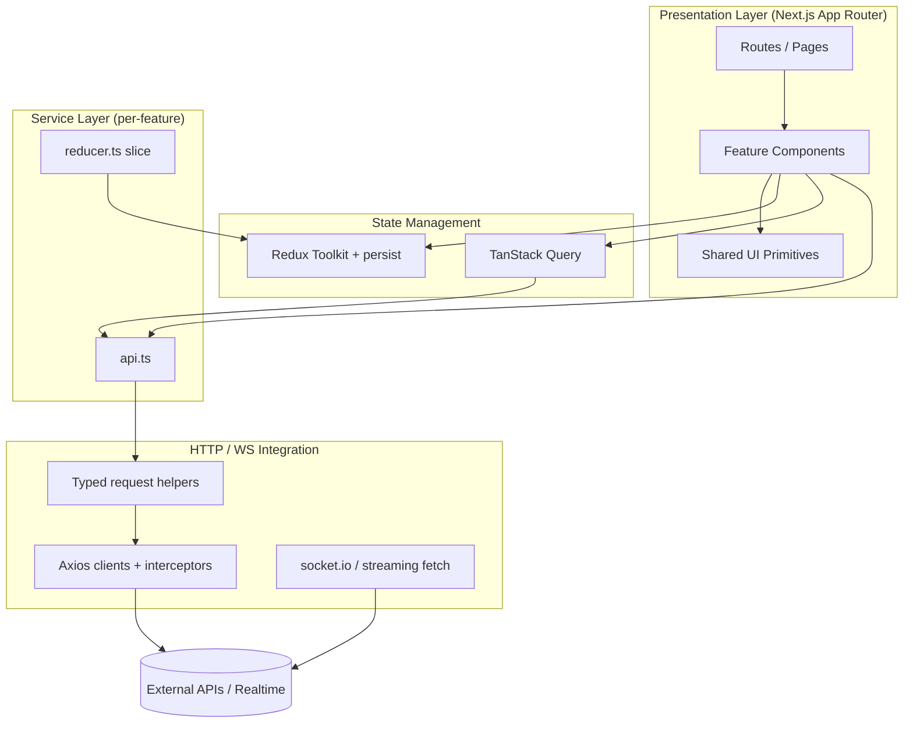
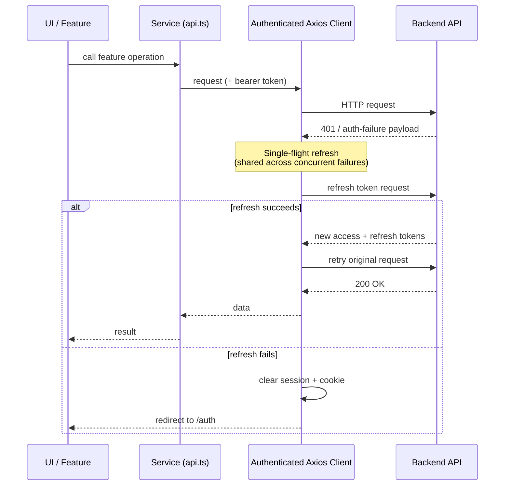
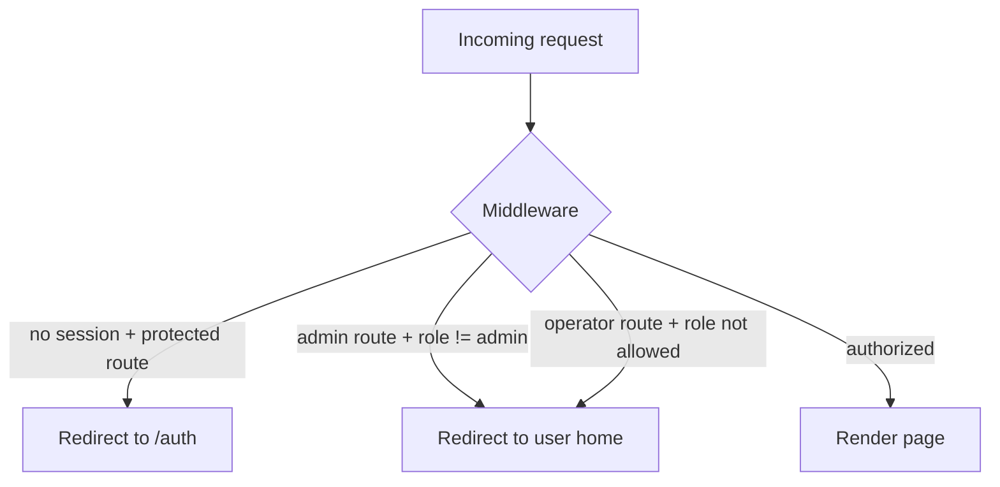

# Architecture Overview (Diagrams)

> Mermaid diagrams describing the architecture at a high level. Sanitized — no
> proprietary modules, endpoints, or business logic are shown.

---

## System Layers

---

## Authentication & Token Refresh Flow

---

## Route Protection (Edge Middleware)

> Diagrams are intentionally generic: route names, role names, and module names
> shown here are illustrative placeholders, not the client's actual taxonomy.
