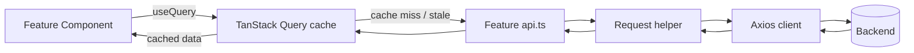
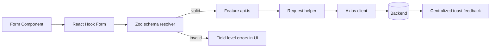
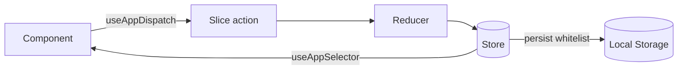
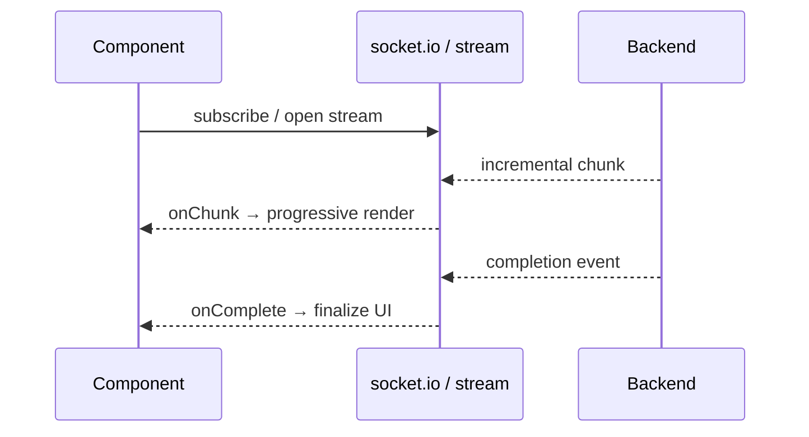

# Component & Data Flow (Diagrams)

> Illustrative data-flow diagrams. Generic and non-proprietary.

---

## Read Path: Server State via TanStack Query

The component never touches the network directly; Query manages caching,
deduplication, and background refresh.

---

## Write Path: Forms → Validation → Service

Validation rules and the resulting TypeScript types come from a **single Zod
schema** — no duplication between the validator and the form's types.

---

## Client State Flow (Redux Toolkit)

Only whitelisted slices are persisted; SSR uses a noop storage fallback.

---

## Real-Time Stream Flow

> All entity names are placeholders for portfolio purposes.
