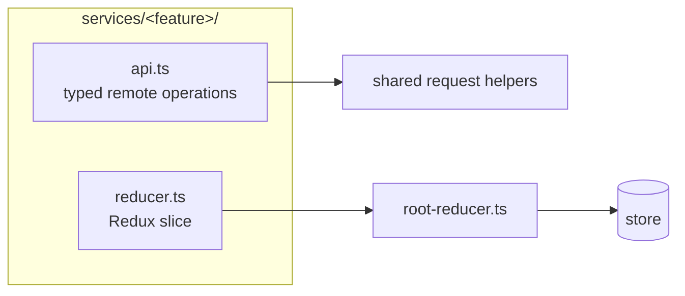

# Folder Structure (Diagram)

> A sanitized, generalized view of how the codebase is organized. Feature names
> are replaced with neutral placeholders to protect confidentiality.

---

## High-Level Layout

```mermaid
flowchart TD
    ROOT[Project Root] --> APP[app/ — App Router routes]
    ROOT --> COMP[components/ — UI + feature components]
    ROOT --> SVC[services/ — per-feature api + slice]
    ROOT --> STORE[store/ — Redux store + root reducer]
    ROOT --> HOOKS[hooks/ — reusable React hooks]
    ROOT --> UTILS[utils/ — enums, helpers, validations, integration]
    ROOT --> ENV[environments/ — staging & production config]
    ROOT --> PUB[public/ — static assets & locales]
    ROOT --> CI[.github/workflows/ — CI/CD pipeline]

    APP --> APP_USER[user workspace routes]
    APP --> APP_ADMIN[admin console routes]
    APP --> APP_OPS[operator routes]

    COMP --> COMP_UI[ui/ — shared primitives]
    COMP --> COMP_FEAT[feature components]

    UTILS --> U_ENUM[enums/]
    UTILS --> U_HELP[helpers/]
    UTILS --> U_VALID[validations/]
    UTILS --> U_INT[integration/ — axios]
    UTILS --> U_IFACE[interfaces/]
    UTILS --> U_LIB[lib/]
```

---

## The Feature Module Unit

Each capability is a self-contained module pairing data access with state:

This consistency means **every** feature is found in the same place and follows
the same shape — a key maintainability property.

> See [`../examples/folder-structure-example.md`](../examples/folder-structure-example.md)
> for an annotated tree.
