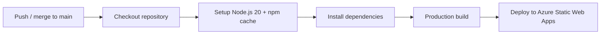

# Delivery Process

> How code moved from a developer's machine to a live production environment on
> this commercial engagement. Sanitized — no secrets, hostnames, or client
> identifiers are included.

---

## 1. Branching & Integration

- **`main` is the production branch.** It is treated as always-deployable.
- Feature work is integrated via **pull requests**, enabling review before code
  reaches `main`.
- The deployment pipeline is **triggered by merges to `main`**, so the deployed
  artifact is always traceable to a specific, reviewed commit.

```
feature branch ──PR──▶ review ──merge──▶ main ──CI/CD──▶ production
```

---

## 2. Environment Segregation

Two clearly separated environments, each with its own configuration file and
build command:

| Environment | Purpose | Build/Run command (conceptual) |
|-------------|---------|-------------------------------|
| **Staging** | Pre-production validation | `dev:staging`, `build:staging` |
| **Production** | Live customer-facing build | `build:production`, `start:production` |

- Configuration is injected per environment using `dotenv-cli`, so a build can
  never accidentally pick up the wrong settings.
- Only **public, non-secret** values (API base URL, payment publishable key,
  socket URL) are exposed to the client bundle via `NEXT_PUBLIC_*` variables.

---

## 3. Continuous Integration & Deployment

The CI/CD pipeline is implemented with **GitHub Actions** and deploys to
**Azure Static Web Apps**:



Pipeline characteristics:

- **Pinned runtime** — Node.js 20, matching the `engines` constraint in
  `package.json`.
- **Dependency caching** — npm cache speeds up repeat builds.
- **Production build** — the deploy step runs the production build command,
  ensuring the deployed artifact matches the production configuration.
- **Secrets via CI secret store** — the API base URL, socket URL, payment key,
  and deployment token are all supplied as **GitHub Actions secrets**, never
  committed to source.
- **Manual dispatch** — the workflow also supports `workflow_dispatch` for
  controlled, on-demand redeploys.

---

## 4. Build Optimization

- The Next.js build emits a **standalone output**, suitable for portable
  deployment.
- The build cache is cleared after build (`rimraf .next/cache`) to keep deploy
  artifacts lean.
- **Turbopack** accelerates the local development loop.

---

## 5. Release Verification

Before and during a release:

1. **Static gates** — lint and type checks catch regressions early.
2. **Staging-first** — changes are validated against the staging environment
   before production promotion.
3. **Pipeline gate** — a failing build blocks deployment; only successful
   production builds are published.
4. **Traceability** — every production deploy maps to a reviewed `main` commit.

See [`quality-assurance.md`](quality-assurance.md) for the verification layers in
more detail.

---

## 6. Rollback Posture

Because deployments are tied to Git commits and the platform retains prior
deployments, recovery from a bad release is achieved by **redeploying a known-good
commit** (re-running the pipeline on a previous `main` state) rather than ad-hoc
hotfixing in the live environment.
